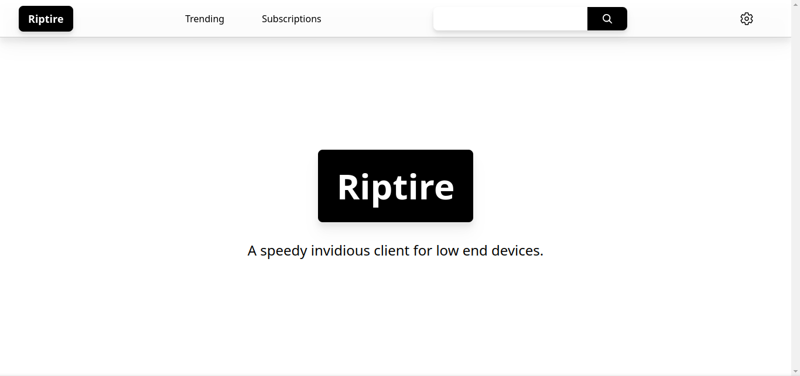
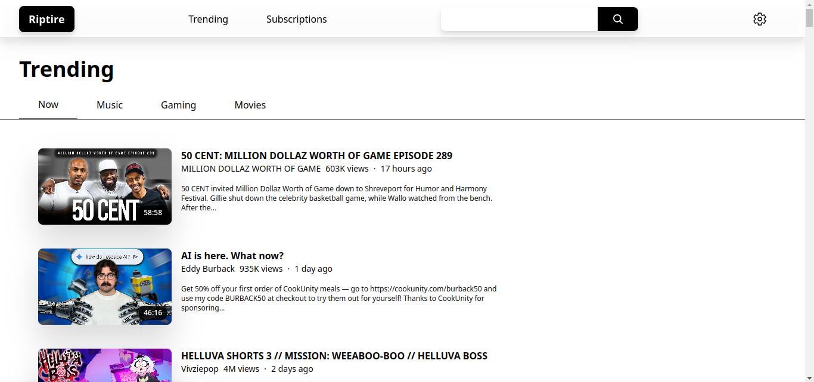
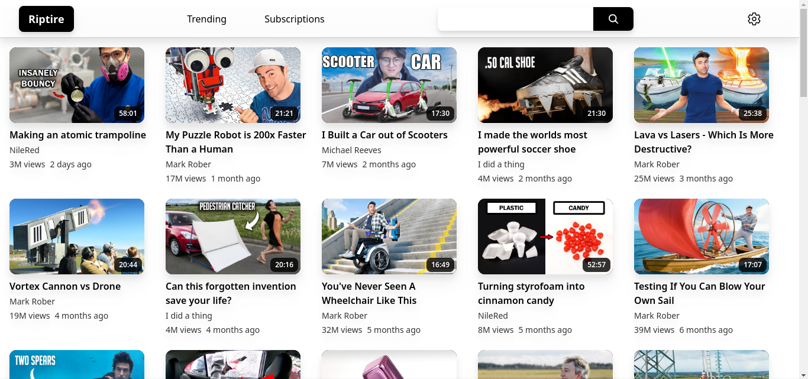
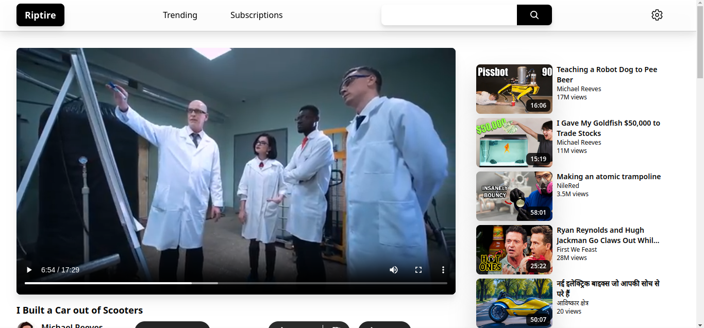

<h1 align="center"> riptire </h1>

	A lightweight invidious client.

	

## What you miss out on with Invidious

- Youtube's Sleek UI
- Subscriptions

## What you gain from Invidious

- Liberation from Google
- A performant experience (~6x less memory usage!)

## What riptire brings to the table

Riptire aims to bring both of these together, to make the switch off YouTube painless.  
This isn't some electron wrapper either, which ends up using even more RAM than youtube.

## Gallery

## Note

The [Invidious](https://github.com/iv-org/invidious) project is great, and you should support it if possible.
This wouldn't be possible without the help of users [selflessly hosting Invidious instances](https://docs.invidious.io/instances).

*This project is not affiliated with Invidious nor YouTube.*
